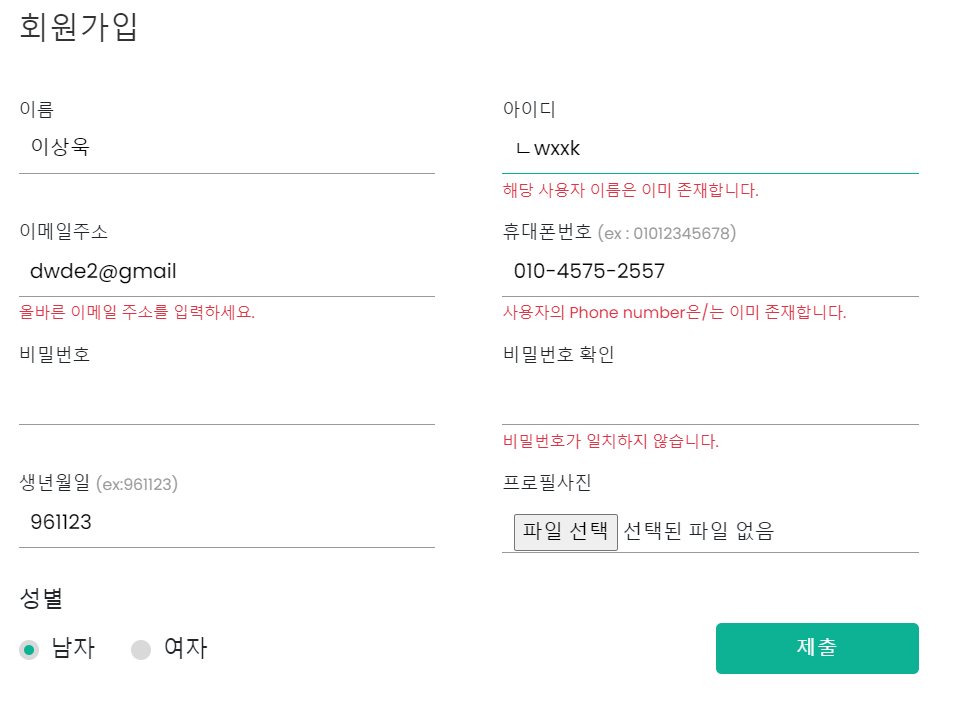

# YEOLDY🤟

## 메인

### 🤟 열디의 주요기능

#### **1.** 쇼핑

👉 카카오페이 결제 서비스

#### **2.** **리뷰를 통한** **커뮤니티 기능**

👉 상품 리뷰, 상품 문의

👉 스타일 공유(자신이 구매한 상품을 사용산 스타일 자랑)

### 🍽 다플 사이트 소개

#### [ 메인페이지 ]

- 웹사이트를 들어가면 가장 먼저 나오는 페이지
- 자바스크립트를 활용해 생동감 있게 구현

#### [ Accounts ]

- 카카오와 네이버 소셜로그인을 구현하였지만, 배포 이후의 오류로 네이버만 성공함

  

- 로그인과 업데이트 폼에 부트스트랩 폼을 썼을 때 처럼 오류메세지 표시

#### [ Cart ]

- 로그인 되었을 때, 해당 유저의 장바구니를 띄움
- product별 수량, 색상, 사이즈를 띄우고, 전체 수량 및 개수도 띄움
- 같은 product여도, 색상 또는 사이즈가 다르면 다른 상품으로 인식하도록 함
- 장바구니에서도 수량이 변경하도록 함
- 카카오페이 테스트 결제 기능과 장바구니를 연동함
- 카카오페이 결제 완료 시, 장바구니에서 삭제 및 결제완료 상품을 따로 데이터베이스에 저장함

#### [ Kakaopay ]

- 장바구니와 카카오페이 테스트 결제 시스템을 연동함
- 결제 창에 2개 이상의 상품이 들어있는 경우는 '~외 몇건' 으로 처리
- 배송 완료 건에 대한 데이터베이스(OrderList)를 구축함
- 결제 전, 배송 정보를 입력받고 이를 임시 데이터베이스에 저장

#### [ Chat ]

- 지역, 맛집 이름 을 통한 검색기능

  => 장고의 Q를 활용함

- 가게이름 순, 좋아요 많은 순 등으로 추가 필터링 구현

  => 비동기 방식을 활용함

#### [ Community ]

- 지역, 맛집 이름 을 통한 검색기능

  => 장고의 Q를 활용함

- 가게이름 순, 좋아요 많은 순 등으로 추가 필터링 구현

  => 비동기 방식을 활용함

#### [ Products ]

- 지역, 맛집 이름 을 통한 검색기능

  => 장고의 Q를 활용함

- 가게이름 순, 좋아요 많은 순 등으로 추가 필터링 구현

  => 비동기 방식을 활용함

#### [ Style ]

- 지역, 맛집 이름 을 통한 검색기능

  => 장고의 Q를 활용함

- 가게이름 순, 좋아요 많은 순 등으로 추가 필터링 구현

  => 비동기 방식을 활용함

### 🍽 AWS를 통한 배포

### 🍽 사용한 기술스택

### 🍽 프로젝트 참여자들

### 🍽 프로젝트 후기

**최준우** : 운이 좋아 좋은 팀원분들을 만나서 일주일동안 크게 어려움없이 재밌게 진행한것 같습니다. 감사합니다. 

**윤효근** : 일주일을 하얗게 불태웠습니다. 고생한만큼 많이 배운것 같습니다. 팀원분들 사랑합니다. 

**권세빈** : 처음으로 일주일동안 프로젝트를 해보았는데 힘든 만큼 배우는 것도 많고 얻어가는게 많아서 좋았습니다. 

**여다영** : 일주일 동안 한다고 힘들었지만 너무 재미있었어요 ㅎㅎㅎ 세빈이와 아이들 짱🤍